# Isaac Lab计算巢快速部署

## 概述

Isaac Lab 建立在 Isaac Sim 之上，利用最新的仿真技术提供了一个统一且灵活的机器人学习框架。它设计为模块化和可扩展的，旨在简化机器人研究中的常见工作流（例如强化学习、示范学习和运动规划）。虽然它包含一些预构建的环境、传感器和任务，但其主要目标是提供一个开源、统一且易于使用的接口，用于开发和测试自定义环境和机器人学习算法。


## 计费说明

Issac Lab在计算巢上的费用主要涉及：

- 所选vCPU、GPU与内存规格
- 系统盘类型及容量
- 公网带宽

计费方式包括：

- 按量付费（小时）
- 包年包月

预估费用在创建实例时可实时看到。

## 服务架构

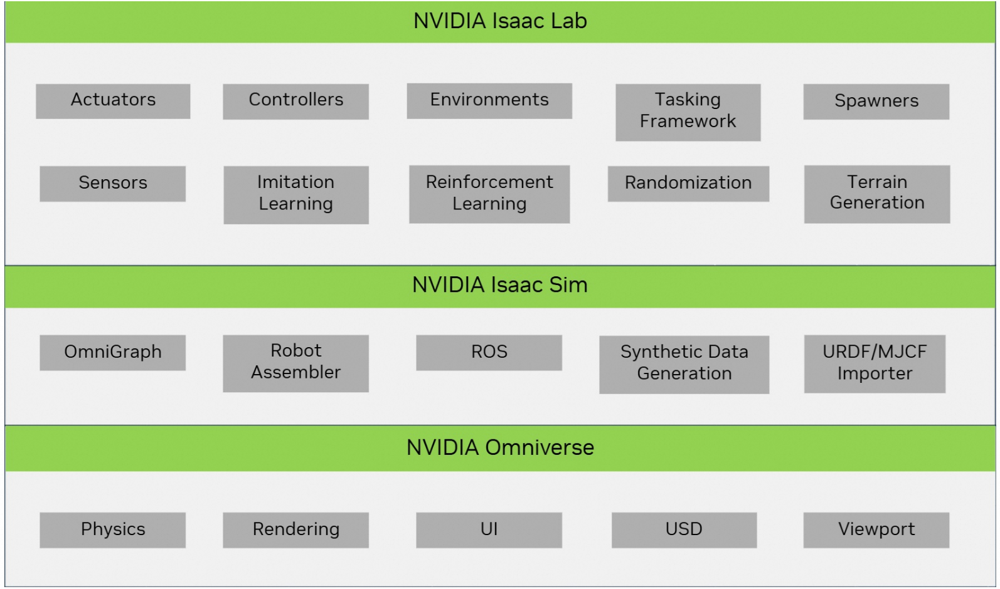

## RAM账号所需权限

Isaac Lab服务需要对ECS、VPC等资源进行访问和创建操作，若您使用RAM用户创建服务实例，需要在创建服务实例前，对使用的RAM用户的账号添加相应资源的权限。添加RAM权限的详细操作，请参见[为RAM用户授权](https://help.aliyun.com/document_detail/121945.html)。所需权限如下表所示。


| 权限策略名称                         | 备注 |
|--------------------------------| --- |
| AliyunECSFullAccess            | 管理云服务器服务（ECS）的权限 |
| AliyunVPCFullAccess            | 管理专有网络（VPC）的权限                     |
| AliyunROSFullAccess            | 管理资源编排服务（ROS）的权限                   |
| AliyunComputeNestUserFullAccess | 管理计算巢服务（ComputeNest）的用户侧权限         |


## 部署流程

### 部署步骤
#### 第一步：选择配置
1. 服务实例名称，可以自定义，也可以使用默认 
2. 地域，建议就近选中，以获取更好的网络延时 
3. 付费类型，选择按量付费或包年包月 
4. 实例类型，需要选择GPU实例，官方推荐使用ecs.gn6i-c40g1.10xlarge实例规格，详见Isaac sim官网阿里云部署文档[Alibaba Cloud Deployment](https://docs.isaacsim.omniverse.nvidia.com/latest/installation/install_advanced_cloud_setup_alibaba.html)

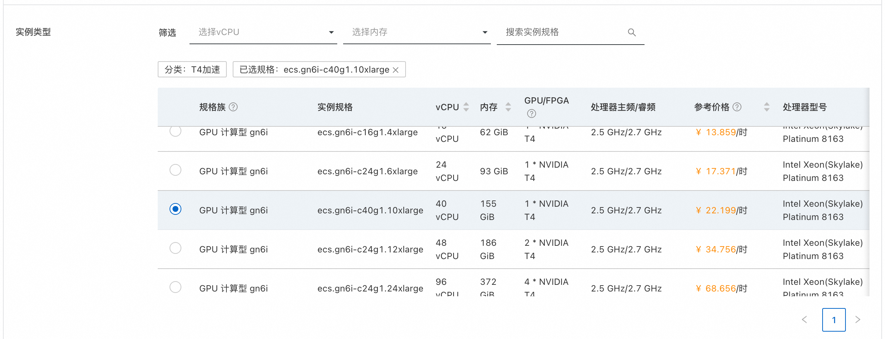
5. 实例密码，用来设置ECS实例的密码 
6. 可用区配置里，可以选择地域下对应的可用区，选择已有或新建VPC网络

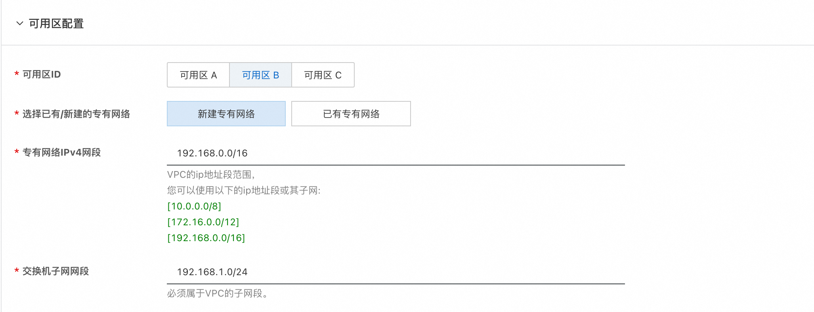

#### 第二步：创建服务实例
1. 选择完服务需要的配置后，点击立即创建，既可以进行服务实例创建。

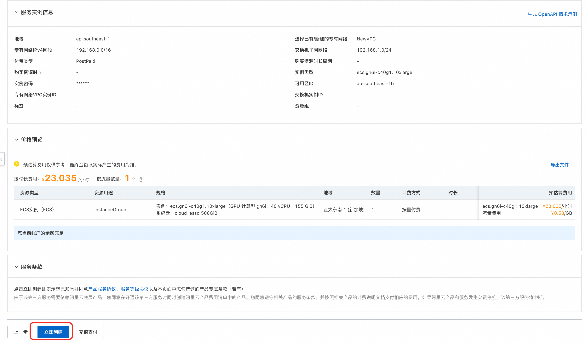
2. 服务实例创建发起后，会进入到服务实例列表页面，这里可以看到服务实例的部署进度。

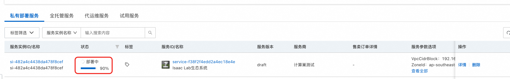

#### 第三步：查看实例详情
1. 当服务实例状态变成"已部署"，点击服务实例名称，进入到对应的服务实例详情页面。

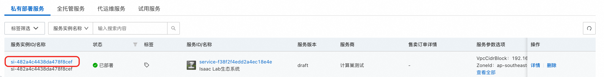
2. 服务实例详情"立即使用"模块中，可以看到服务器的IP地址，具体使用方式参见上面的服务部署和使用说明。

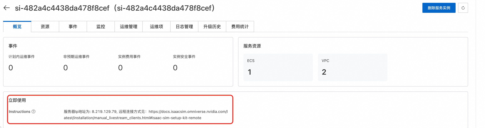

## 使用教程
服务实例部署好以后，怎么进行使用呢，可以参考下面的使用教程，这里有两种方式可以使用我们部署好的Isaac Lab服务。
### 使用方式一：通过Omniverse Streaming Client远程连接使用
Isaac Lab服务在启动时会自动启动Isaac Sim，您可以通过Omniverse Streaming Client远程连接Isaac Sim，使用图形界面快速开发和调试机器人。
#### 第一步：下载安装Omniverse Streaming Client

1. Omniverse Streaming Client安装需要准备一台带GPU的Windows系统电脑，并需要安装GPU Grid驱动。
```
如果您当前没有Windows系统的带GPU的PC，您可以通过阿里云无影服务购买一台带GPU的Windows系统电脑，来进行Client安装，
最低配置要求为4 vCPU / 10 GiB / 2GiB 显存，无影云电脑会自动安装GPU Grid驱动，无需进行手动安装。
无影云电脑购买方式见:https://help.aliyun.com/zh/wuying-workspace/user-guide/create-a-cloud-computer-3?spm=a2c4g.11186623.help-menu-68242.d_2_0_1_1_0.7aa232ccLyfHZl
```
2. Omniverse Streaming Client下载地址为[链接](https://docs.isaacsim.omniverse.nvidia.com/latest/installation/download.html#isaac-sim-latest-release),选择其中的Windows版本进行下载。

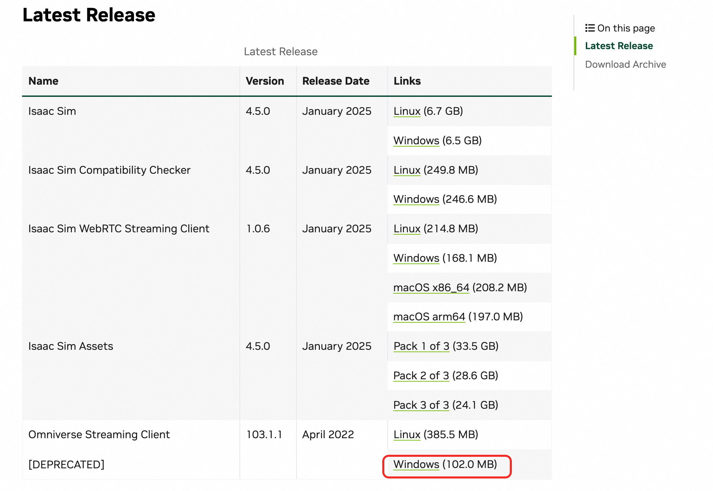

3. 下载完成后，解压文件，进入解压后的目录，点击omniverse-streaming-client.exe即可打开连接界面。

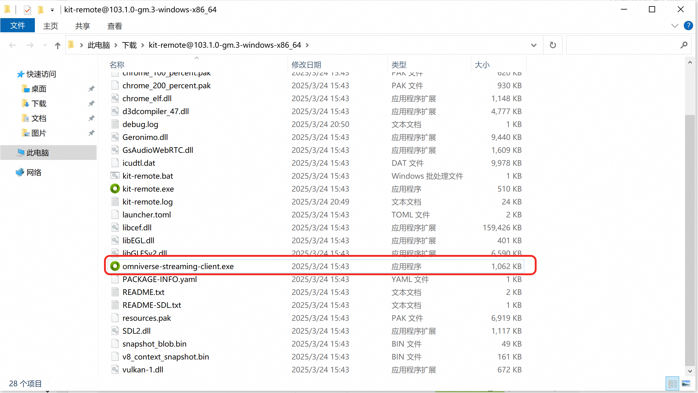
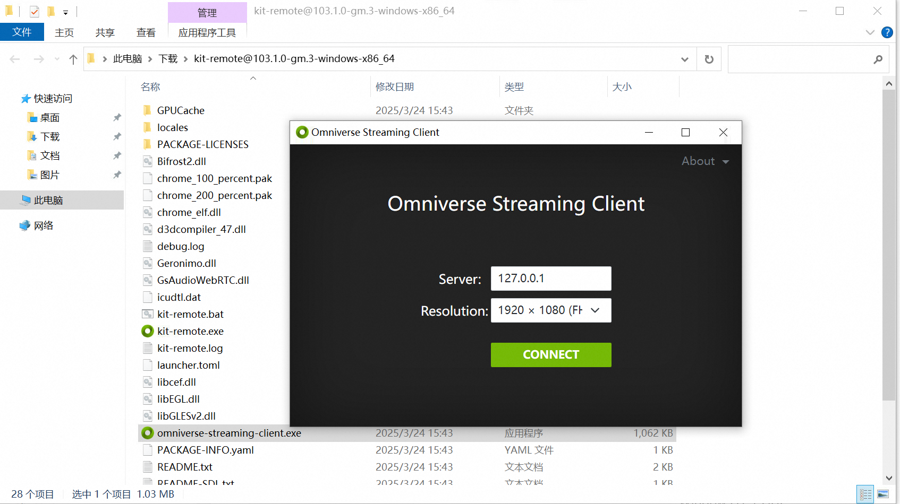

#### 第二步：Client连接Isaac Sim, 进行图形化开发和调试

1. Omniverse Streaming Client打开连接界面后，在Server里输入Isaac Lab服务实例的IP地址，点击Connect即可连接Isaac Sim。

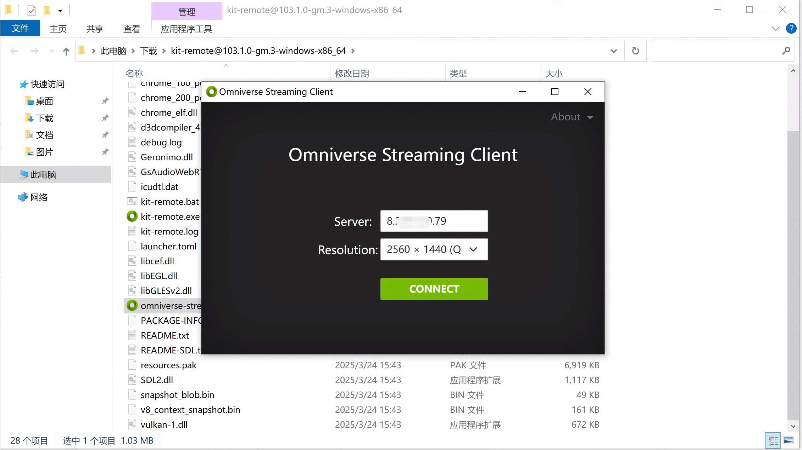
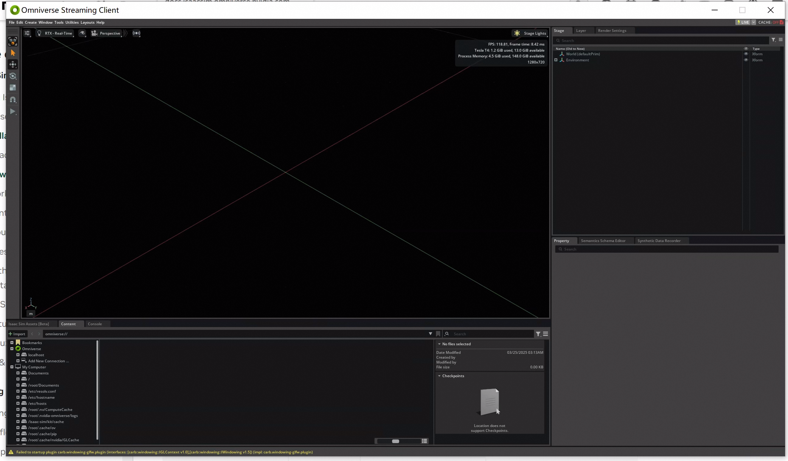
2. 这里以[Issac Sim入门教程](https://docs.isaacsim.omniverse.nvidia.com/latest/introduction/quickstart_isaacsim.html)为例，可以创建出一个画布平面和一个立方体，如下所示。

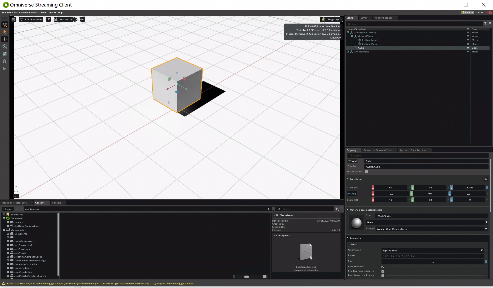
3. 您也可以进行其他更复杂的操作，例如创建一个机器人，并进行运动规划、控制、训练等。

### 使用方式二：通过SSH远程连接执行python脚本进行训练
Isaac Lab服务目前通过docker镜像的方式进行安装，使用的镜像为官方提供的标准镜像加上Isaac Sim启动所需要的插件cache，可以到容器内部去执行训练使用的python脚本。
1. 在服务实例详情页的资源中，点击远程连接可以登录到Ecs服务器中。

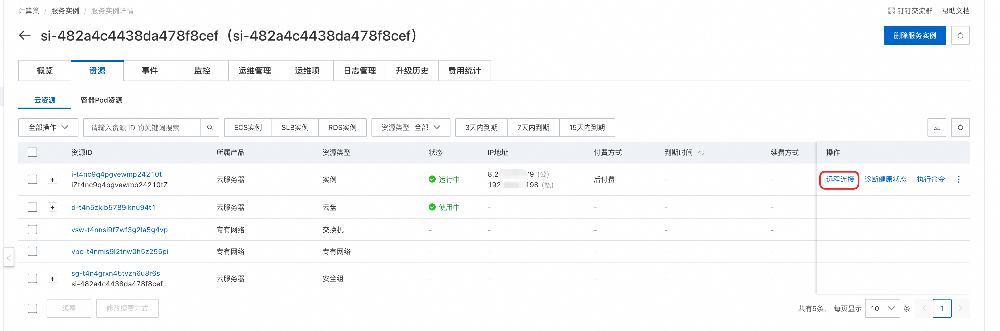
2. 执行docker ps -a命令，可以看到isaac-lab容器的运行状态。

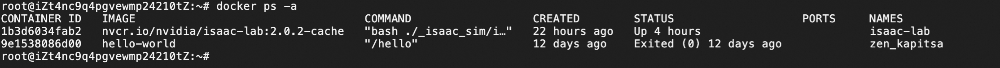
3. 执行docker exec -it isaac-lab bash命令，进入到容器内部。

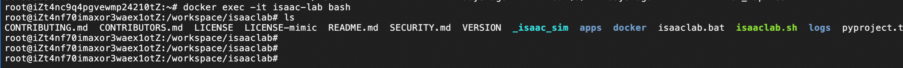
4. 这里以[官网教程](https://docs.robotsfan.com/isaaclab/source/deployment/docker.html)为例，执行./isaaclab.sh -p scripts/tutorials/00_sim/log_time.py --headless，
可以看到能顺利执行，您也可以执行您自己的训练脚本。

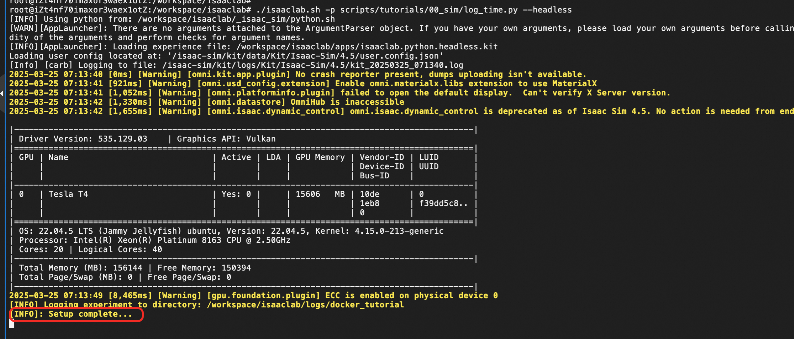
