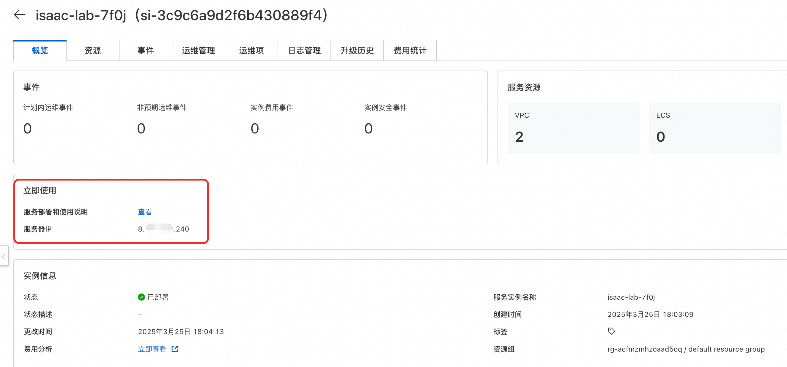

# Isaac Lab计算巢快速部署

## 概述

Isaac Lab 建立在 Isaac Sim 之上，利用最新的仿真技术提供了一个统一且灵活的机器人学习框架。它设计为模块化和可扩展的，旨在简化机器人研究中的常见工作流（例如强化学习、示范学习和运动规划）。虽然它包含一些预构建的环境、传感器和任务，但其主要目标是提供一个开源、统一且易于使用的接口，用于开发和测试自定义环境和机器人学习算法。


## 计费说明

Issac Lab在计算巢上的费用主要涉及：

- 所选vCPU、GPU与内存规格
- 系统盘类型及容量
- 公网带宽

计费方式包括：

- 按量付费（小时）
- 包年包月

预估费用在创建实例时可实时看到。

## 服务架构


## RAM账号所需权限

Isaac Lab服务需要对ECS、VPC等资源进行访问和创建操作，若您使用RAM用户创建服务实例，需要在创建服务实例前，对使用的RAM用户的账号添加相应资源的权限。添加RAM权限的详细操作，请参见[为RAM用户授权](https://help.aliyun.com/document_detail/121945.html)。所需权限如下表所示。


| 权限策略名称                         | 备注 |
|--------------------------------| --- |
| AliyunECSFullAccess            | 管理云服务器服务（ECS）的权限 |
| AliyunVPCFullAccess            | 管理专有网络（VPC）的权限                     |
| AliyunROSFullAccess            | 管理资源编排服务（ROS）的权限                   |
| AliyunComputeNestUserFullAccess | 管理计算巢服务（ComputeNest）的用户侧权限         |


## 部署流程

### 部署步骤
#### 第一步：选择配置
1. 服务实例名称，可以自定义，也可以使用默认 
2. 地域，建议就近选中，以获取更好的网络延时 
3. 付费类型，选择按量付费或包年包月 
4. 实例类型，需要选择GPU实例，官方推荐使用ecs.gn6i-c40g1.10xlarge实例规格，详见Isaac sim官网阿里云部署文档[Alibaba Cloud Deployment](https://docs.isaacsim.omniverse.nvidia.com/latest/installation/install_advanced_cloud_setup_alibaba.html)


5. 实例密码，用来设置ECS实例的密码 
6. 可用区配置里，可以选择地域下对应的可用区，选择已有或新建VPC网络


#### 第二步：创建服务实例
1. 选择完服务需要的配置后，点击立即创建，既可以进行服务实例创建。


2. 服务实例创建发起后，会进入到服务实例列表页面，这里可以看到服务实例的部署进度。


#### 第三步：查看实例详情
1. 当服务实例状态变成"已部署"，点击服务实例名称，进入到对应的服务实例详情页面。


2. 服务实例详情"立即使用"模块中，可以看到服务器的IP地址，具体使用方式参见上面的服务部署和使用说明。



## 使用教程
Isaac Lab服务实例内置完整的Isaac Sim应用，支持两种训练模式：既可独立使用Isaac Sim进行仿真训练，也可基于Isaac Lab框架进行强化学习训练。 

对应的ECS实例安装了Ubuntu图形界面，支持在ECS控制台通过VNC的方式直接使用。
### VNC方式访问ECS实例
1. 在服务实例详情页的资源中，找到对应的ECS实例，点击去到ECS控制台。

   

2. 点击右上角的远程连接，选择VNC登录方式，即可进入到Ubuntu系统的图形界面。

   

3. 这里需要输入isaac-sim账户对应登录密码，对应的密码和ECS实例密码一致，可以去服务实例概览页面查看。

   

### Isaac Sim使用方式
通过上面的方式登录到ECS实例后，打开Terminal，可以看到isaac-sim账户下有isaacsim和isaacsim_assets两个目录。
- isaacsim目录为Isaac Sim的安装目录，里面有Isaac Sim相关的启动和训练脚本。
- isaacsim_assets目录为Isaac Sim的资源目录，这里做了提前下载，方便后面训练使用。


#### 示例1: 以无GUI的方式进行场景合成数据集生成
该示例展示使用omni.replicator扩展生成合成数据集的过程。生成的数据将离线存储（在磁盘上），使其可用于深度神经网络的训练。示例可以在Isaac Sim的Python独立环境中运行，并利用Isaac Sim和Replicator创建离线合成数据集，用于训练机器学习模型。建议将官方示例代码拷贝到用户目录下进行修改及使用。
```shell
cd /home/isaac-sim
mkdir -p isaacsim_test
cd /home/isaac-sim/isaacsim_test
mkdir -p scene_based_sdg
cp -rf /home/isaac-sim/isaacsim/standalone_examples/replicator/scene_based_sdg/* /home/isaac-sim/isaacsim_test/scene_based_sdg/
## 渲染合成(--config指定配置文件路径，其中设置了headless=true；--/persistent/isaac/asset_root/default指定3D资产存储路径)
/home/isaac-sim/isaacsim/python.sh ./scene_based_sdg/scene_based_sdg.py --config="/home/isaac-sim/isaacsim_test/scene_based_sdg/config/config_coco_writer.yaml" --/persistent/isaac/asset_root/default="/home/isaac-sim/isaacsim_assets/Assets/Isaac/4.5"
```
生成结果存储在”./isaacsim_test/_out_coco“中，可视化效果如下：


#### 示例2: 以GUI的方式使用Isaac Sim
在termial中执行以下命令，即可进入Isaac Sim的GUI界面。
```shell
cd /home/isaac-sim/isaacsim
./isaac-sim.sh
```
这里要注意的是，Isaac Sim启动的时候会比较慢，会弹出等待的窗口，不用进行操作，等待一段时间即可。


下面是按[入门教程](https://docs.isaacsim.omniverse.nvidia.com/4.5.0/introduction/quickstart_isaacsim.html)中的步骤创建了个正方体。


### Isaac Lab的使用方式
Isaac Lab服务安装目录在/home/isaac-sim/IsaacLab中，里面有Isaac Lab的安装目录和启动脚本。

#### 示例1： 使用无GUI模式训练智能体
本案例，我们将使用Stable-Baselines3强化学习（RL）框架，以解决Cartpole平衡控制的智能体任务。Stable-Baselines3是一个基于 PyTorch 的强化学习库，提供了多种稳定且易用的 RL 算法，如 PPO、SAC、DQN等。训练目标是，让智能体学习如何控制小车的左右移动，保持摆杆直立不倒。建议将示例代码拷贝到个人目录进行修改和调试。
```shell
cd /home/isaac-sim
mkdir -p isaaclab_test
cd /home/isaac-sim/isaaclab_test
mkdir -p sb3
cp -rf /home/isaac-sim/IsaacLab/scripts/reinforcement_learning/sb3/* /home/isaac-sim/isaaclab_test/sb3/
## 渲染合成(--config指定配置文件路径，其中设置了headless=true；--/persistent/isaac/asset_root/default指定3D资产存储路径)
/home/isaac-sim/IsaacLab/isaaclab.sh -p ./sb3/train.py --task Isaac-Cartpole-v0 --num_envs 64 --headless --video
```
训练结果保存到./logs/sb3/Isaac-Cartpole-v0中；可视化结果如下


#### 示例2： 使用GUI模式生成基本物体到场景中
在Terminal中执行以下命令，即可进入Isaac Lab的GUI界面。
```shell
cd /home/isaac-sim/IsaacLab
./isaaclab.sh -p scripts/tutorials/00_sim/spawn_prims.py
```
