# Isaac Lab Ray集群版部署文档

## 概述

Isaac Lab 建立在 Isaac Sim 之上，利用最新的仿真技术提供了一个统一且灵活的机器人学习框架。它设计为模块化和可扩展的，旨在简化机器人研究中的常见工作流（例如强化学习、示范学习和运动规划）。虽然它包含一些预构建的环境、传感器和任务，但其主要目标是提供一个开源、统一且易于使用的接口，用于开发和测试自定义环境和机器人学习算法。


## 计费说明

Issac Lab在计算巢上的费用主要涉及：

- 所选vCPU、GPU与内存规格
- 系统盘类型及容量
- 公网带宽
- ack集群费用

计费方式包括：

- 按量付费（小时）
- 包年包月

预估费用在创建实例时可实时看到。

## 服务架构

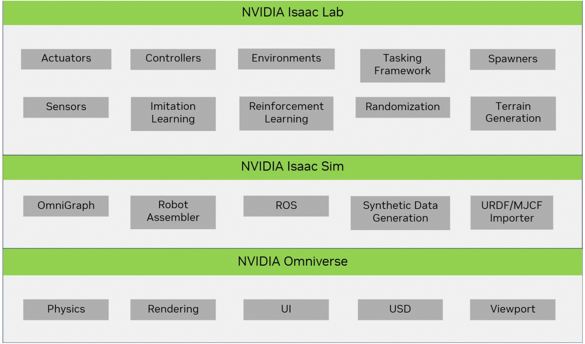

## RAM账号所需权限

Isaac Lab服务需要对ECS、VPC、容器集群等资源进行访问和创建操作，若您使用RAM用户创建服务实例，需要在创建服务实例前，对使用的RAM用户的账号添加相应资源的权限。添加RAM权限的详细操作，请参见[为RAM用户授权](https://help.aliyun.com/document_detail/121945.html)。所需权限如下表所示。


| 权限策略名称                          | 备注                         |
|---------------------------------|----------------------------|
| AliyunECSFullAccess             | 管理云服务器服务（ECS）的权限           |
| AliyunVPCFullAccess             | 管理专有网络（VPC）的权限             |
| AliyunROSFullAccess             | 管理资源编排服务（ROS）的权限           |
| AliyunComputeNestUserFullAccess | 管理计算巢服务（ComputeNest）的用户侧权限 |
| AliyunCloudMonitorFullAccess    | 管理云监控（CloudMonitor）的权限     |
| AliyunCSFullAccess              | 管理容器服务(CS)的权限              |


## 部署流程

### 部署步骤
#### 第一步：选择配置
1. 选择模版，这里选择Ray集群版

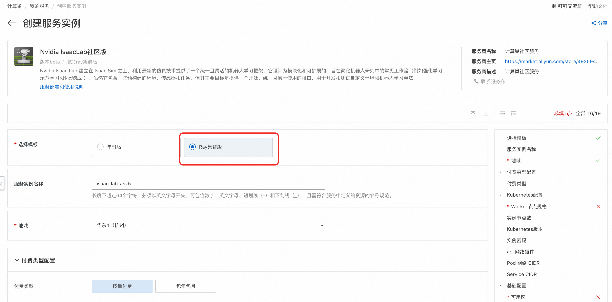

2. 服务实例名称，可以自定义，也可以使用默认 
3. 地域，建议就近选中，以获取更好的网络延时 
4. 付费类型，选择按量付费或包年包月 
5. Kubernetes配置，选择合适的Worker节点实例规格, 设置实例节点数，选择ack网络插件，有flannel和terway两种可选。
   
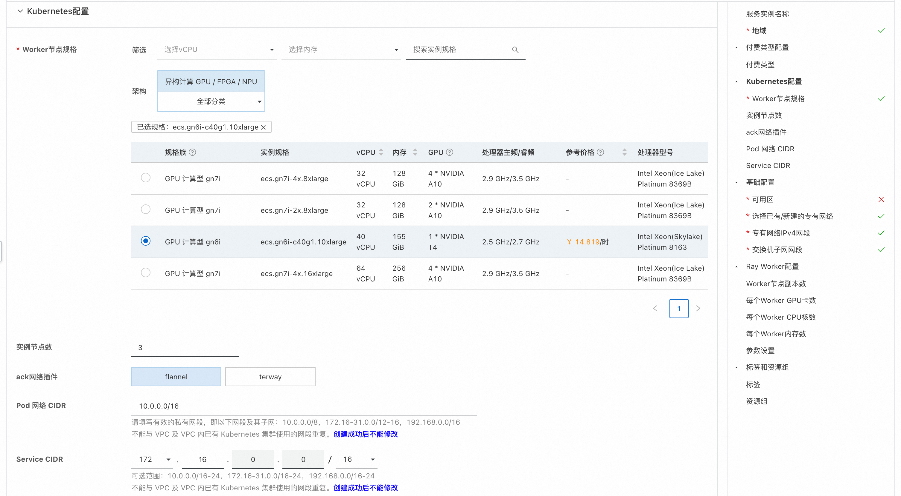

6. 可用区配置里，可以选择地域下对应的可用区，选择已有或新建VPC网络

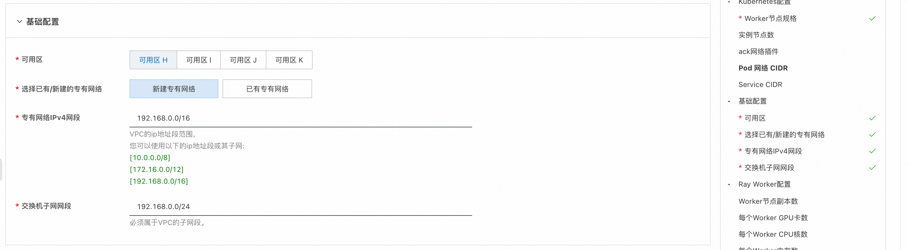

7. 设置Ray Worker配置，这里可以设置Worker节点数和每个Worker的GPU、CPU和内存数，需要注意的是，这里Worker节点
所需资源的总和，需要小于集群节点配置的总和，并且要预留出head节点8核8G的内存，以及k8s控制面组件的相关资源。

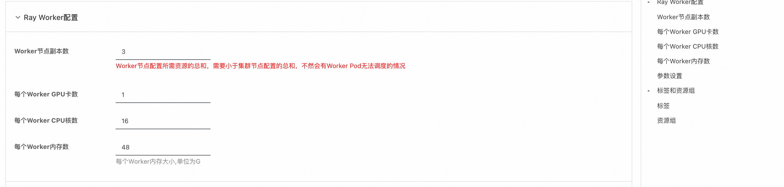

#### 第二步：创建服务实例
1. 选择完服务需要的配置后，点击立即创建，既可以进行服务实例创建。

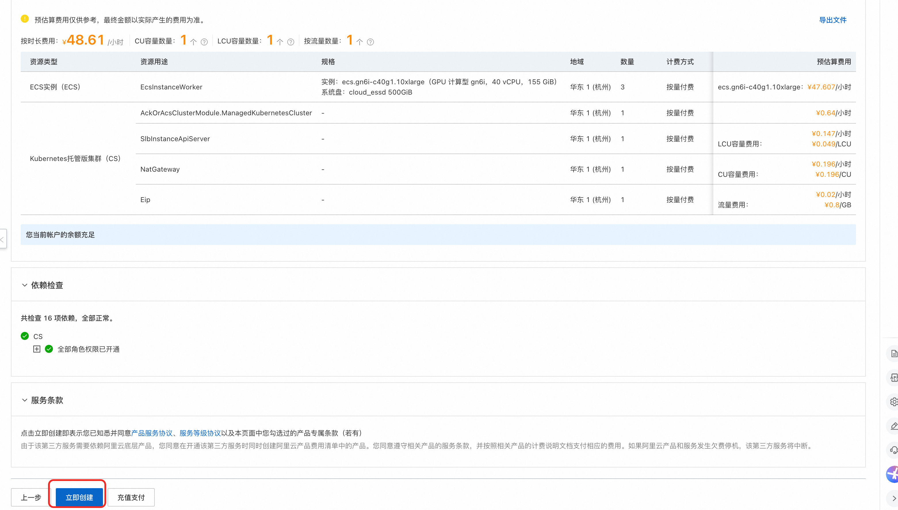

2. 服务实例创建发起后，会进入到服务实例列表页面，这里可以看到服务实例的部署进度。

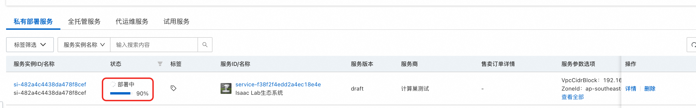

#### 第三步：查看实例详情
1. 当服务实例状态变成"已部署"，点击服务实例名称，进入到对应的服务实例详情页面。

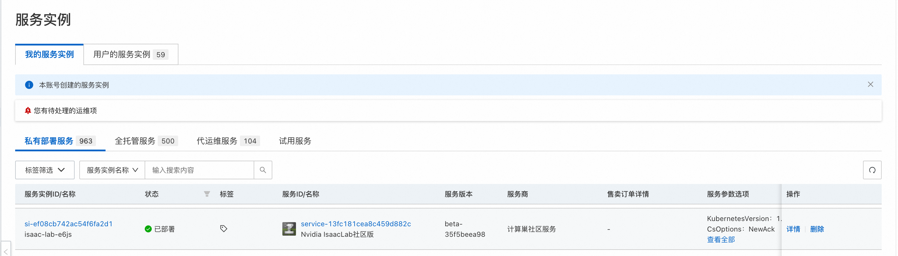
2. 服务实例详情"立即使用"模块中，可以看到ray集群的url，后面配置会使用，具体使用方式参见上面的服务部署和使用说明。

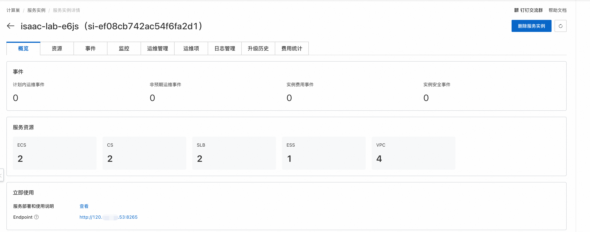

## 使用教程
Isaac Lab 支持 Ray ，用于简化多个训练任务的调度（包括并行和串行），以及超参数调优，适用于本地和远程配置。

Isaac Lab服务Ray作业调度和调优官方文档为[Ray Job Dispatch and Tuning](https://isaac-sim.github.io/IsaacLab/main/source/features/ray.html)。

### 环境准备
1. 在本地电脑配置远程Ray集群信息，具体命令如下：
```shell
# 这里的<ISAACRAY_ADDRESS>为ray集群的url，可以从服务实例概览页中获取
echo "name: isaacray address: <ISAACRAY_ADDRESS>" > ~/.cluster_config
export RAY_ADDRESS="<ISAACRAY_ADDRESS>"
```
2. 从git上下载[Isaac Lab源码](https://github.com/isaac-sim/IsaacLab), 用来做后续的作业提交。
3. 在本地电脑安装ray客户端，命令如下：
```shell
pip install "ray[default]"
```

### 在日志中打印执行结果的测试job
1. 在Isaac Lab源码目录scripts/reinforcement_learning/ray下新建
个测试用的python文件test.py，内容如下：
```python
import ray
import os

# 连接本地或者远程ray cluster
ray.init()

@ray.remote(num_cpus=1)
class Counter:
    def __init__(self):
        self.name = "test_counter"
        self.counter = 0

    def increment(self):
        self.counter += 1

    def get_counter(self):
        return "{} got {}".format(self.name, self.counter)

counter = Counter.remote()

for _ in range(10):
    counter.increment.remote()
    print(ray.get(counter.get_counter.remote()))
```
2. 在Isaac Lab源代码目录下，使用ray提交作业，具体命令如下：
```shell
python3 scripts/reinforcement_learning/ray/submit_job.py --aggregate_jobs wrap_resources.py --sub_jobs "/workspace/isaaclab/isaaclab.sh -p test.py"
```
3. 提交成功后，可以从日志里看到以下信息：
   - 提交作业时，会把scripts/reinforcement_learning/ray目录当作工作目录进行打包，上传到集群中，所以我们的test.py也会被上传。
   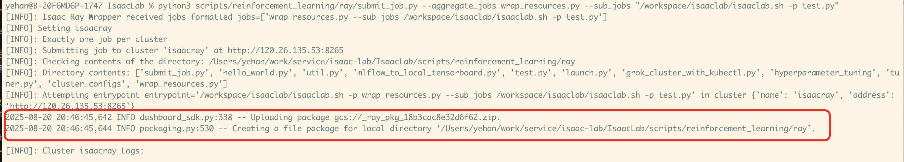
   
   - job运行完成后，可以看到输出的运行信息：
   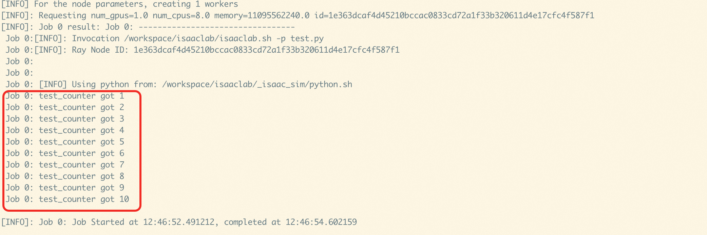

### 执行Isaac Lab训练任务
1. 在Isaac Lab源代码目录下，执行命令提交作业，具体命令如下：
```shell
python3 scripts/reinforcement_learning/ray/submit_job.py --aggregate_jobs wrap_resources.py --sub_jobs "/workspace/isaaclab/isaaclab.sh -p /workspace/isaaclab/scripts/reinforcement_learning/rsl_rl/train.py --task=Isaac-Ant-v0 --headless"
```
2. 提交成功后，可以看到日志里输出的信息，这里主要可以看到job在集群上的工作目录，本例上为_ray_pkg_18b3cac8e32d6f62。

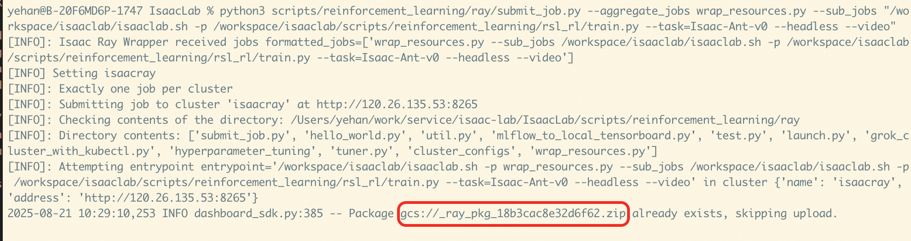

3. 点击ray集群url, 可以到集群的web ui中查看job运行情况。

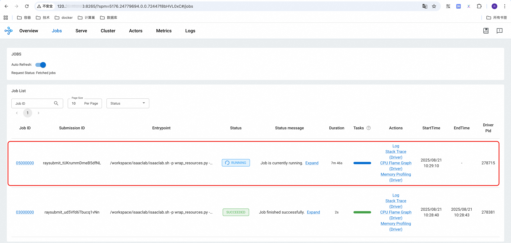

4. 点击正在运行的这个job，可以看到job的调度日志，本例是调度到了c9db26a6c016fb4394991190f132afe99cd4a2b0a696f14185001650节点，
对应的训练结果也要到这个节点上查看。

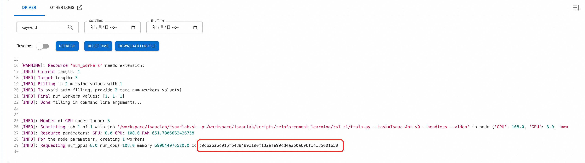

5. 切到Cluster Tab下，输入node id进行搜索，可以找到容器集群中对应的Pod。

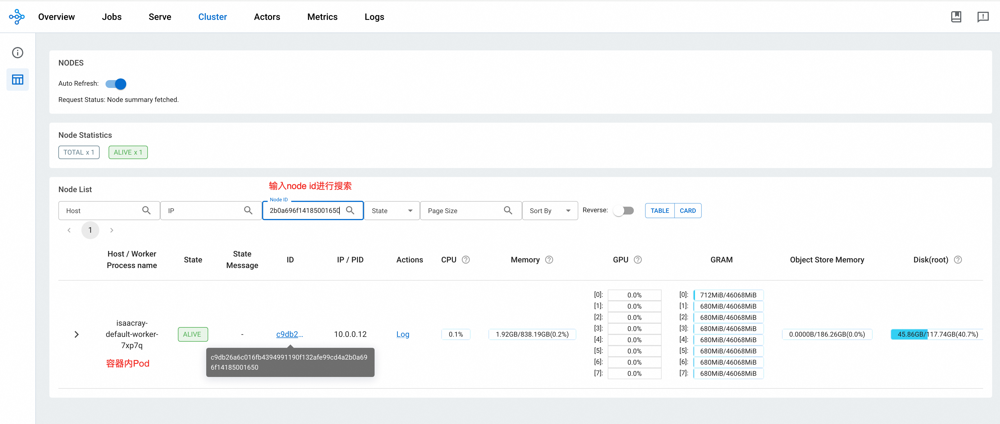

6. 从服务实例资源中找到对应的容器集群，去容器集群中找到上面对应的Pod，并登录到Pod中。

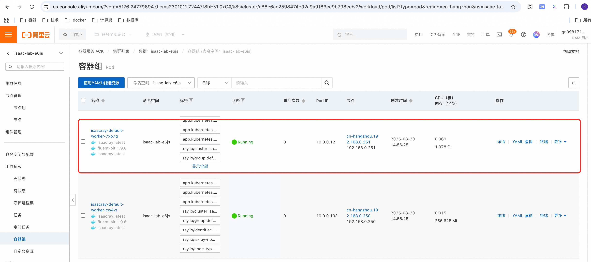

7. 登录到Pod中，可以看到训练结果，本例训练的Ant环境，训练的结果保存在下面的临时目录中：
```shell
# 执行job的临时目录，其中_ray_pkg_18b3cac8e32d6f62取决于上传文件的目录，2025-08-21_08-08-24 是具体运行时间
cd /tmp/ray/session_latest/runtime_resources/working_dir_files/_ray_pkg_18b3cac8e32d6f62/logs/rsl_rl/ant/2025-08-21_08-08-24 
```
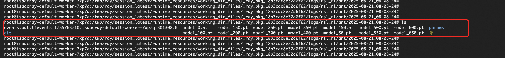


